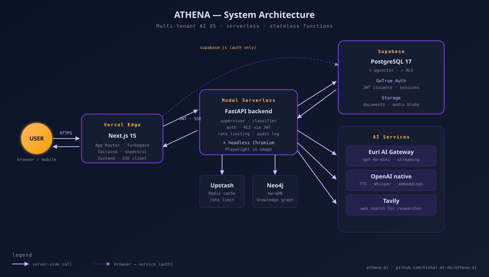
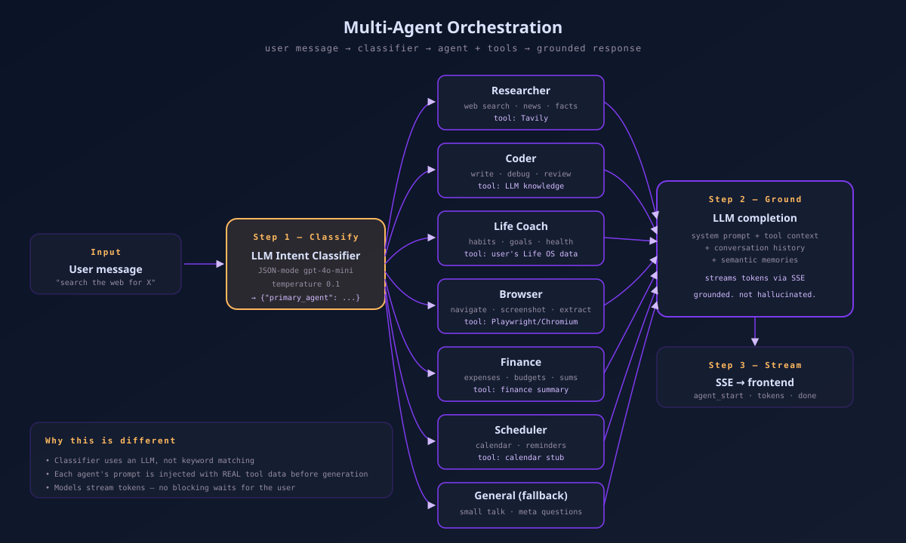
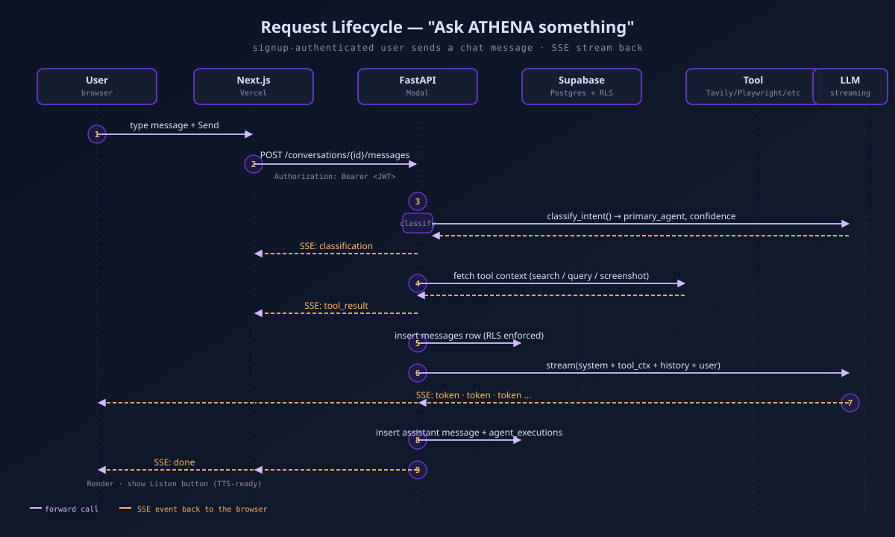
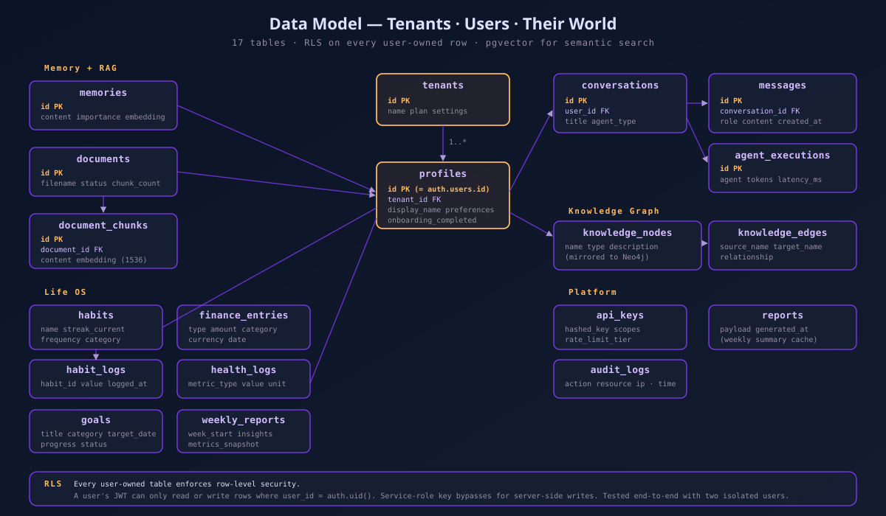

# ATHENA — Personal AI Operating System

> **The AI Goddess That Runs Your Life**

A multi-tenant Personal AI OS with true multi-agent orchestration, voice-first interface, real browser automation, semantic memory, and full life management. Built as a modular monolith on FastAPI + Next.js, shipped on Modal + Vercel.

🔗 **Live demo**: [athena-ai-topaz-two.vercel.app](https://athena-ai-topaz-two.vercel.app)

---

## What Makes ATHENA Different

| Dimension | ATHENA | Typical AI assistants |
|---|---|---|
| **Multi-agent orchestration** | 7 specialized agents, semantic intent routing via an LLM classifier | One prompt, maybe a persona swap |
| **Memory** | `pgvector` embeddings — remembers facts across sessions, cites sources | No memory or shallow context window |
| **Life OS** | Habits + goals + finance + health, each with CRUD, streaks, analytics, and an agent that reads the real data | Not attempted |
| **Real browser** | Headless Chromium on Modal: navigates, screenshots, extracts text, grounds answers in page content | Simulated steps at best |
| **Voice** | OpenAI TTS + Whisper round-trip: per-message "Listen" button, mic-ready backend | Optional or external |
| **Knowledge graph** | Entity extraction from chat → dual-written to Supabase and Neo4j | None |
| **Multi-tenant from day one** | Row-level security (RLS) on every table, tenant isolation verified end-to-end | Single-user |

---

## System Architecture



**Modular monolith.** One FastAPI app, strict module boundaries: `agents`, `routers`, `services`, `models`, `core`. One Next.js app, App Router, every dashboard route inside an auth-guarded layout group.

---

## Multi-Agent Flow



Each agent gets its own system prompt and — critically — **real tool data injected before generation**. The researcher sees Tavily results, the life coach sees the user's actual habits, the browser agent sees the real page text. That grounding is what turns "chatbot" into "assistant".

---

## Request Lifecycle — "Ask ATHENA a question"



---

## Data Model



RLS is enforced on every user-owned table — a user's JWT cannot read or write another tenant's rows even at the SQL level.

---

## Tech Stack

| Layer | Tech |
|---|---|
| **Frontend** | Next.js 15 (App Router, Turbopack) · TypeScript strict · Tailwind · shadcn/ui · Zustand |
| **Backend** | FastAPI · Pydantic v2 · httpx async · Supabase Python SDK |
| **Database** | Supabase (PostgreSQL 17 + pgvector + RLS + Auth + Storage) |
| **LLMs** | Euri AI gateway (gpt-4o-mini) for chat · OpenAI native for TTS, Whisper, embeddings |
| **Web search** | Tavily API (researcher agent) |
| **Real browser** | Playwright (Chromium) on Modal |
| **Knowledge graph** | Neo4j AuraDB (dual-write with Supabase fallback) |
| **Cache / rate limit** | Upstash Redis |
| **Deployment** | Vercel (frontend) · Modal (backend, serverless + stateless) |

---

## The 7 Agents

| Agent | Tools | Example triggers |
|---|---|---|
| **Researcher** | Tavily web search | "search the web", "latest news", "what's the current version of..." |
| **Scheduler** | Calendar stub | "remind me", "plan my day" |
| **Life Coach** | Habits + goals + health reads | "how are my habits?", "weekly report" |
| **Coder** | Code generation | "write a function", "fix this bug" |
| **Browser** | Real Playwright: navigate, screenshot, extract | "open this URL and tell me X" |
| **Finance** | Finance entry reads + summary math | "track expenses", "monthly spend" |
| **General** | Plain chat | everything else |

---

## Getting Started

### Prerequisites
- Python 3.12+, Node.js 20+
- Supabase project (free tier fine)
- Euri AI key (200K tokens/day free) — or swap in any OpenAI-compatible gateway
- OpenAI key (TTS + embeddings)
- Optional: Tavily, Neo4j AuraDB, Upstash Redis

### Clone + install

```bash
git clone https://github.com/Vishal-ml-ds/athena-ai.git
cd athena-ai

# Backend
cd backend
python -m venv venv && source venv/Scripts/activate
pip install -r requirements.txt
cp ../.env.example .env              # fill in keys

# Frontend
cd ../frontend
npm install
cp .env.example .env.local           # fill in NEXT_PUBLIC_* keys

# Database
# Run backend/sql/001..010 in the Supabase SQL Editor, in order.

# Run locally
cd ../backend && uvicorn app.main:app --port 8005
cd ../frontend && npm run dev -- --port 3002
```

### Deploy to production

```bash
# Frontend → Vercel
cd frontend && vercel --prod

# Backend → Modal (chromium is baked into the image)
cd backend && python -m modal deploy modal_app.py

# Seed demo data
ATHENA_DEMO_EMAIL=you@example.com python -m backend.scripts.seed_demo
```

### Environment variables

**Backend (`backend/.env`)**
```
SUPABASE_URL=https://xxx.supabase.co
SUPABASE_ANON_KEY=...
SUPABASE_SERVICE_ROLE_KEY=...
DATABASE_URL=postgresql://...
EURI_API_KEY=...
TAVILY_API_KEY=...
OPENAI_API_KEY=...
NEO4J_URI=neo4j+s://....databases.neo4j.io
NEO4J_USERNAME=neo4j
NEO4J_PASSWORD=...
REDIS_URL=rediss://...
CORS_ORIGINS=https://your-frontend.vercel.app,http://localhost:3000
```

**Frontend (`frontend/.env.local`)**
```
NEXT_PUBLIC_SUPABASE_URL=https://xxx.supabase.co
NEXT_PUBLIC_SUPABASE_ANON_KEY=...
NEXT_PUBLIC_API_URL=https://your-backend.modal.run
```

---

## API — selected endpoints

```
Auth              POST   /api/v1/auth/signup
                  POST   /api/v1/auth/login
                  POST   /api/v1/auth/refresh
                  POST   /api/v1/auth/onboarding

Conversations     GET    /api/v1/conversations
                  POST   /api/v1/conversations
                  POST   /api/v1/conversations/{id}/messages   ← SSE

Life OS           GET    /api/v1/life/habits         POST   /api/v1/life/habits
                  POST   /api/v1/life/habits/{id}/log
                  GET    /api/v1/life/goals          POST   /api/v1/life/goals
                  PATCH  /api/v1/life/goals/{id}/progress
                  GET    /api/v1/life/finance        POST   /api/v1/life/finance
                  GET    /api/v1/life/finance/summary
                  GET    /api/v1/life/health         POST   /api/v1/life/health

Documents         GET    /api/v1/documents           POST   /api/v1/documents
                  POST   /api/v1/documents/query                ← RAG

Voice             POST   /api/v1/voice/transcribe             ← Whisper
                  POST   /api/v1/voice/synthesize              ← OpenAI TTS

Browser agent     POST   /api/v1/browser/stream                ← SSE + PNG frames

Knowledge         GET    /api/v1/knowledge/graph

Analytics         GET    /api/v1/analytics/usage
                  GET    /api/v1/analytics/agent-distribution

Reports           GET    /api/v1/reports/weekly
                  GET    /api/v1/reports/history
```

Full OpenAPI spec is auto-generated at `/docs` on the deployed backend.

---

## Project Structure

```
athena-ai/
├── backend/
│   ├── app/
│   │   ├── agents/               # Multi-agent system
│   │   │   ├── supervisor.py     # Orchestration + tool-grounded prompts
│   │   │   ├── intent_classifier.py
│   │   │   └── tools/            # web_search, life_tools, real_browser
│   │   ├── core/                 # Config, dependencies, middleware, security
│   │   ├── routers/              # auth, conversations, life, documents, voice, browser, ...
│   │   ├── services/             # memory_service, knowledge_service, neo4j_client, report_service
│   │   ├── models/               # Pydantic schemas
│   │   └── main.py               # FastAPI app factory
│   ├── sql/                      # 10 numbered migrations (tenants → RLS restore)
│   ├── scripts/seed_demo.py      # Idempotent demo data seeder
│   ├── requirements.txt
│   └── modal_app.py              # Modal image + ASGI entrypoint
├── frontend/
│   ├── src/
│   │   ├── app/
│   │   │   ├── (auth)/           # login, signup, forgot-password, reset-password, onboarding
│   │   │   └── (dashboard)/      # chat, life, memory, documents, browser, knowledge, report, agents, insights, settings
│   │   ├── components/           # Chat bubbles, sidebar, notification center, onboarding steps, ...
│   │   ├── stores/               # Zustand: conversations, life, documents
│   │   └── lib/                  # API client, Supabase clients, utils
│   └── public/
├── docs/                         # BRD, PRD, Architecture, API spec, UI design spec, demo script
├── context/PROGRESS.md           # Session-by-session log
└── sprints/                      # Sprint plans
```

---

## Testing and Audits

This repo was built and verified feature-by-feature. Every user-visible flow is exercised end-to-end via real headless Chromium, not just curl.

- **API + CORS surface**: 32/32 pass
- **UI pages + navigation**: 14/14 pass
- **Feature clicks** (chat, Life OS, Browser, Voice, Docs): 6/6 pass
- **Deep workflows** (signup → chat → persist → reload → cross-feature): 18/18 pass
- **Logic invariants** (two isolated users, tenant isolation, streak math, RAG groundedness, TTS/Whisper round-trip, conversation memory): 25/25 pass

Scripts live outside the repo but the infrastructure that makes this testable (testids, SSE event shapes, stable tenant isolation) is all in-tree.

---

## Design System

**"Celestial Intelligence"** — a premium dark theme inspired by luxury AI concierge aesthetics.

- **Fonts**: Space Grotesk (headlines), Inter (body), JetBrains Mono (code)
- **Colors**: Deep obsidian `#0b1326`, Nebula purple `#7c3aed` / `#d2bbff`, Solar gold `#ffb95f`
- **Style**: Glassmorphism, tonal shifts over borders, editorial layout

---

## License

MIT

---

Built by **Vishal** · [aiwithvishal.com](https://aiwithvishal.com) · [GitHub](https://github.com/Vishal-ml-ds)
